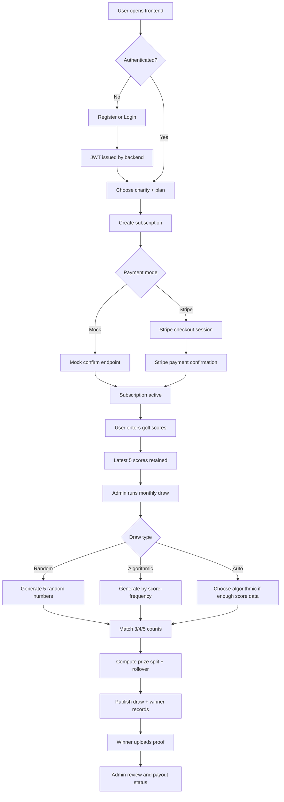
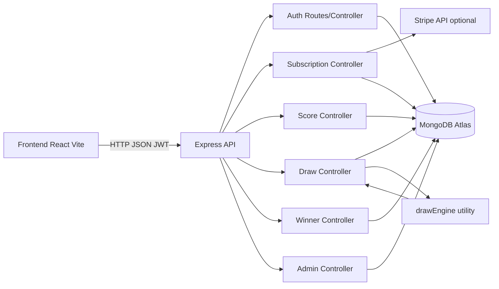
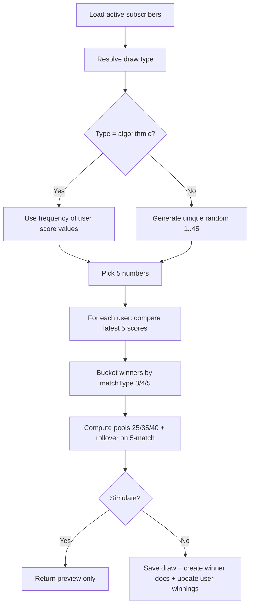

# Golf Charity Subscription Platform

Full-stack MERN project for subscription-based golf score tracking, monthly prize draws, and transparent charity impact.

This repository is designed for showcase and evaluator review: it includes seeded demo data, complete end-to-end flow, deployment instructions, and architecture diagrams.

## Live Architecture

- Frontend: React + Vite + Tailwind, deployed on Vercel
- Backend: Node.js + Express API, deployed on Render
- Database: MongoDB Atlas
- Auth: JWT with role-based route guards
- Payments: Mock mode and Stripe test mode

## Live Deployment Links

- Frontend: https://golfcharitysubscriptionplatform-gray.vercel.app/
- Backend API: https://golfcharitysubscriptionplatform.onrender.com

## Core Features

- Secure authentication and role-based authorization (user/admin)
- Subscription plans (monthly/yearly) with activation lifecycle
- Charity selection with donation contribution updates
- Golf score entry with validation and rolling latest-5 score logic
- Monthly draw engine:
	- Random mode
	- Algorithmic mode (frequency-based)
	- Auto mode (switches by available score data)
- Winner lifecycle:
	- Draw publication
	- Proof upload by winner
	- Admin approval/rejection and payout status
- Admin dashboard analytics and user oversight

## Demo Seed Data

Use showcase seed scripts to generate realistic, connected data.

### Backend seed commands

```bash
cd backend
npm run seed:showcase
npm run seed:showcase:reset
```

### Seeded credentials

- Admin: admin@golfcharity.com / Admin@123
- User: aarav@example.com / User@123
- User: sara@example.com / User@123
- User: rohan@example.com / User@123

## Local Development

### 1) Backend

```bash
cd backend
npm install
cp .env.example .env
npm run dev
```

### 2) Frontend

```bash
cd frontend
npm install
cp .env.example .env
npm run dev
```

## Environment Variables

### Backend (backend/.env)

- PORT=5000
- NODE_ENV=development
- MONGO_URI=your_mongodb_connection
- JWT_SECRET=your_secret
- STRIPE_SECRET_KEY=sk_test_xxx
- PAYMENT_MODE=mock or stripe
- DEMO_MODE=true or false
- FRONTEND_URL=https://golfcharitysubscriptionplatform-gray.vercel.app

### Frontend (frontend/.env)

- VITE_API_URL=http://localhost:5000/api

## Production Deployment

### A) Push to GitHub

```bash
git add .
git commit -m "chore: production-ready docs, deploy config, diagrams, favicon"
git push origin main
```

### B) Deploy Backend on Render

- Create a new Web Service from this repository.
- Root directory: backend
- Build command: npm install
- Start command: npm start
- Add environment variables from backend/.env.example.
- Set NODE_ENV=production.
- Set FRONTEND_URL to your Vercel domain.

Health check URL after deploy:

- GET / should return: { "message": "Golf Charity API running" }

### C) Deploy Frontend on Vercel

- Import repository into Vercel.
- Root directory: frontend
- Framework preset: Vite
- Build command: npm run build
- Output directory: dist
- Add env variable:
    - VITE_API_URL=https://golfcharitysubscriptionplatform.onrender.com/api

Note: frontend/vercel.json already includes SPA route rewrite to index.html.

## Draw Logic Summary

- Pool basis: 35% of active subscription revenue
- Allocation:
	- 3 matches: 25%
	- 4 matches: 35%
	- 5 matches: 40% + previous rollover
- If no 5-match winner, rollover carries to next published draw.

## API Overview

- Auth: /api/auth/register, /api/auth/login, /api/auth/me
- Scores: /api/scores
- Charities: /api/charities (+ admin CRUD)
- Subscriptions: /api/subscriptions
- Draws: /api/draws, /api/draws/run (admin)
- Winners: /api/winners/me, proof upload, review (admin)
- Admin: /api/admin/analytics, /api/admin/users

## Validation Checklist (Reviewer Friendly)

- Backend starts successfully
- Frontend production build succeeds
- Login and role guard paths work
- Subscription activation updates user status
- Score validation enforces integer range 1..45
- Draw simulation and publish flow both work
- Winner proof and admin review endpoints function

# Project Flowchart and Connection Algorithm

This document explains system flow and how backend components connect for evaluator review.

## 1) End-to-End User Flow



## 2) Project Connection Diagram



## 3) Draw Connection Algorithm (Implemented Logic)



## 4) Prize Pool Formula

- Gross pool: sum of active subscription amounts.
- Draw pool: `gross * 0.35`.
- Buckets:
  - 3 matches: `25%` of draw pool
  - 4 matches: `35%` of draw pool
  - 5 matches: `40%` of draw pool + previous rollover
- If no 5-match winner, 5-match pool rolls to next month.


## Notes

- A root .gitignore is added for secure GitHub publishing.
- Local .env files are ignored; keep only .env.example tracked.
- Custom favicon replaces default Vite icon for better branding.
